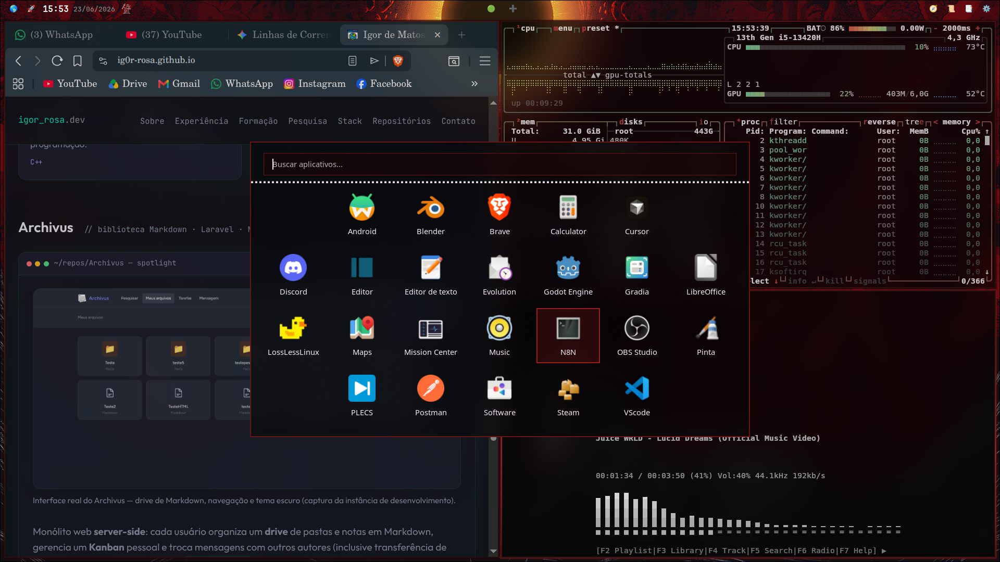

# MeuHypr

Backup completo do ambiente **Hyprland + SDDM** personalizado (baseado nos dotfiles [JaKooLit/Hyprland-Dots](https://github.com/JaKooLit/Hyprland-Dots)), pronto para reinstalar em outra máquina Debian.

## Preview



*Hyprland + waybar + SwayNC + rofi + kew (visualizador) — captura real do ambiente.*

> **Wallpaper padrão:** `assets/wallpapers/matrix-default.jpg` (SDDM + fallback Hyprland). Wallpapers extras em `~/Pictures/wallpapers/`.

---
 
## O que está incluído

| Pasta | Conteúdo |
|-------|----------|
| `config/hypr/` | Hyprland, scripts, regras de janela, wallust |
| `config/waybar/` | Barra superior minimalista (Igor Essential) |
| `config/rofi/` | Launcher Super+D, menu de energia, temas Wallust |
| `config/swaync/` | Painel de notificações |
| `config/kitty/` | Terminal sem decoração, opacidade no fundo |
| `config/yazi/` | Gerenciador de arquivos TUI (`Super+A` = terminal na pasta) |
| `config/wlogout/` | Menu de energia (Super+Alt+Delete) |
| `config/wallust/` | Geração de cores a partir do wallpaper |
| `config/zsh/` | Zsh com oh-my-zsh + Starship |
| `config/kew/` | kewrc padrão (v4, visualizador, cache) |
| `config/gtk-*`, `qt*ct`, `fuzzel/` | Temas GTK/Qt e alternador de janelas |
| `config/starship.toml` | Prompt do Zsh |
| `system/` | SDDM, sessão Wayland e wrapper `hyprland-session` |
| `system/grub/` | Tema GRUB `clean` (só fundo + lista de boot) |
| `assets/wallpapers/` | Wallpaper padrão Matrix (SDDM + fallback) |
| `sddm/themes/noc-sddm/` | Tema SDDM minimalista personalizado |

---

## Pré-requisitos (Debian 13 puro)

| Item | Detalhe |
|------|---------|
| **SO** | Debian 13 (trixie) instalado (netinst ou imagem completa) |
| **Usuário** | Conta normal com **sudo** |
| **Rede** | Internet estável (vários `git clone` + compilações — **30–60+ min**) |
| **Repositórios** | Recomendado habilitar **non-free** e **non-free-firmware** (NVIDIA, Wi‑Fi) |
| **Hardware** | Ajuste `UserConfigs/ENVariables.conf` se não usar NVIDIA |
| **Teclado** | ABNT2 já configurado em `UserConfigs/UserSettings.conf` |
| **Fonte** | [JetBrainsMono Nerd Font](https://www.nerdfonts.com/font-downloads) — pós-instalação manual |

### Habilitar non-free no Debian (recomendado)

```bash
sudo sed -i 's/main$/main contrib non-free non-free-firmware/' /etc/apt/sources.list
sudo apt update
```

---

## Instalação

```bash
git clone https://github.com/Ig0r-Rosa/MeuHypr.git
cd MeuHypr
chmod +x install.sh
sudo ./install.sh
```

O script instala **o essencial** para a sessão Hyprland funcionar com os atalhos configurados:

1. **Sessão:** Hyprland (compilado), waybar, kitty, swaync, wlogout, fuzzel, swww, portals
2. **Login:** SDDM como gerenciador padrão + tema `noc-sddm`
3. **Shell:** zsh, **oh-my-zsh**, Starship
4. **Atalhos:** Rofi Wayland (Super+D, Super+S, Super+H), grim/slurp, cliphist
5. **TUIs:** yazi, btop, nvtop, cmatrix, bluetui (Cargo), **kew v4**, dua-cli, oxker, pulsemixer, hyprmoncfg, nmtui
6. **Navegador:** firefox-esr (Super+B)
7. Copia configs para `~/.config/` (Hyprland, kewrc padrão se não existir, etc.)

**Não** instala automaticamente: Steam, Discord, Nautilus, pavucontrol, driver NVIDIA, nwg-displays, etc.

### Só reaplicar configs (sem reinstalar pacotes)

```bash
sudo MEUHYPR_CONFIG_ONLY=1 ./install.sh
```

### Instalar para outro usuário

Substitua `nome_do_usuario` pelo login Linux da conta destino (ex.: `maria`, `dev`).

```bash
# Instalação completa (pacotes + configs) para a conta indicada
sudo MEUHYPR_TARGET_USER=nome_do_usuario ./install.sh

# Só reaplicar configs em outra conta (sem reinstalar pacotes)
sudo MEUHYPR_TARGET_USER=nome_do_usuario MEUHYPR_CONFIG_ONLY=1 ./install.sh
```

O script ajusta automaticamente caminhos em `~/.config` (ex.: `/home/igor/` → `/home/nome_do_usuario/`).

### Pós-instalação manual

1. **Fonte:** JetBrainsMono Nerd Font → `~/.local/share/fonts/` e `fc-cache -fv`
2. **NVIDIA** (se aplicável): `sudo apt install nvidia-driver firmware-misc-nonfree`
3. **Monitores:** edite `~/.config/hypr/monitors.conf` ou use **hyprmoncfg** (SwayNC 🖥️)
4. **Músicas:** copie arquivos para `~/Músicas/` (kew usa essa pasta)
5. **Wallpapers extras:** `~/Pictures/wallpapers/` — use `Super+W` para escolher
6. **Reinicie** e faça login no **SDDM** (sessão Hyprland)

### Apps opcionais (instalação manual)

| App | Comando sugerido | Atalho / uso |
|-----|------------------|--------------|
| Nautilus | `sudo apt install nautilus` | Super+E (fallback automático para yazi) |
| pavucontrol | `sudo apt install pavucontrol` | Mixer de áudio GUI |
| Steam | `sudo apt install steam` + `setup-steam-hyprland.sh` | Scripts em `hypr/scripts/Steam*.sh` |
| nwg-displays | via repositório nwg ou AUR equivalente | Menu KooL Quick Settings |
| Discord, etc. | flatpak / snap / apt | Pelo launcher Super+D |

---

## Dependências (pacotes e apps)

### Compositor e ecossistema Hypr

| Pacote / binário | Função |
|------------------|--------|
| Hyprland | Compositor Wayland (compilado em `/usr/local/bin`) |
| hyprsunset | Filtro de luz noturna |
| hyprctl | Controle do compositor |
| xdg-desktop-portal-hyprland | Portals (screenshot, etc.) |

### Barra, launcher e notificações

| Pacote | Função |
|--------|--------|
| waybar | Barra superior |
| rofi (Wayland) | Launcher Super+D, busca Super+S, atalhos Super+H |
| fuzzel | Alternador de janelas Super+J |
| swaync | Centro de notificações (duplo Super) |
| wlogout | Menu de energia Super+Alt+Delete |
| swww | Daemon de wallpaper |

### Terminal, arquivos e navegador

| Pacote | Função |
|--------|--------|
| kitty | Terminal padrão (`Super+Return`) |
| yazi (Cargo) | Gerenciador TUI (`Super+E`, waybar 📑; `Super+A` abre terminal na pasta) |
| firefox-esr | Navegador padrão (`Super+B`, waybar 🧭) |
| zsh + oh-my-zsh + starship | Shell com prompt customizado |

### TUIs e monitoramento

| Pacote / binário | Função |
|------------------|--------|
| btop, nvtop | Monitor de sistema (SwayNC 📊) |
| cmatrix | Efeito Matrix (waybar 🌎) |
| kew v4 (compilado) | Player de música (instalado; sem botão no SwayNC) |
| pulsemixer (APT) | Controlador de áudio TUI (SwayNC 🔊) |
| dua-cli (Cargo) | Uso de disco (SwayNC 💾) |
| bluetui (Cargo) | Bluetooth Super+; / SwayNC 🌀 |
| nmtui | Rede Super+ç / SwayNC 🌐 |
| hyprmoncfg | Layout de monitores (SwayNC 🖥️) |

### Áudio, rede e energia

| Pacote | Função |
|--------|--------|
| pipewire, wireplumber | Áudio |
| pamixer, playerctl | Atalhos de volume/mídia |
| network-manager, nmtui | Rede |
| brightnessctl | Brilho máximo no boot |

### Captura e clipboard

| Pacote | Função |
|--------|--------|
| grim, slurp | Screenshot (`Print`) |
| wl-clipboard, cliphist | Histórico de clipboard |

### Temas e aparência

| Pacote | Função |
|--------|--------|
| wallust | Cores dinâmicas do wallpaper |
| qt5ct, qt6ct, kvantum | Apps Qt |
| fonts-noto, fonts-firacode | Fontes base |

### Login

| Pacote | Função |
|--------|--------|
| sddm | Gerenciador de login |
| noc-sddm (este repo) | Tema SDDM personalizado |

### GRUB (menu de boot)

Tema `clean`: só o **wallpaper + a lista de boot** (Linux / Windows), com painel
escuro translúcido, realce arredondado na seleção e barra de contagem do timeout.
Remove o título do topo e as mensagens de ajuda em EN/PT. Aplicado pelo `install.sh`.

| Item | Detalhe |
|------|---------|
| `system/grub/themes/clean/theme.txt` | Layout do menu (painel + seleção + progress bar) |
| `system/grub/themes/clean/menu-30.pf2` | Fonte JetBrains Mono (gerada via `grub-mkfont`) |
| `system/grub/themes/clean/background.jpg` | Wallpaper do menu (self-contained) |
| `system/grub/themes/clean/{panel,selected}_*.png` | PNGs 9-slice (painel e realce) |
| `system/grub/themes/clean/generate-assets.py` | Regenera os PNGs (requer Pillow) |
| `system/scripts/setup-grub-theme.sh` | Espelha o tema, ativa `GRUB_THEME` e roda `update-grub` |
| `system/grub/reference/` | Cópias de referência do `/etc/default/grub` e `40_custom` (não aplicadas) |

> Aplicar manualmente: `sudo system/scripts/setup-grub-theme.sh`. Fundo do menu: troque
> `system/grub/themes/clean/background.jpg`. Backup do `/etc/default/grub` é criado a cada execução.

---

## Atalhos de teclado

`Super` = tecla Windows. Atalhos desativados na config **não** aparecem abaixo.

### Aplicativos e launcher

| Atalho | Ação |
|--------|------|
| `Super+D` | Launcher de apps (Rofi, grid central) |
| `Super+Shift+D` | Apps ocultos no launcher |
| `Super+Return` | Abrir terminal (kitty) |
| `Super+E` | yazi (ou Nautilus se instalado) |
| `Super+B` | Abrir navegador padrão (Firefox) |
| `Super+A` | Terminal na pasta atual (Nautilus ou yazi) |
| `Super+L` | Abrir lixeira no Nautilus (requer Nautilus) |
| `Super+J` | Alternador de janelas (Fuzzel) |
| `Super+S` | Busca web (Rofi) |
| `Super+H` | Buscar atalhos disponíveis |
| `Super+Alt+E` | Menu de emoji |
| `Super+Alt+R` | Recarregar Waybar e menus |

### Janelas

| Atalho | Ação |
|--------|------|
| `Super+Q` | Fechar janela ativa |
| `Super+Shift+Q` | Encerrar processo da janela |
| `Super+Space` | Alternar janela flutuante (reduz/centraliza) |
| `Super+←` / `Super+→` | Janela anterior / próxima na área atual |
| `Alt+Tab` | Alternar janelas |
| `Super+Ctrl+Tab` | Alternar janela dentro do grupo |
| `Super+Ctrl+H` | Tirar janela do grupo |
| `Super+Ctrl+K` / `Super+Ctrl+L` | Mover janela para grupo (esq/dir) |

### Áreas de trabalho

| Atalho | Ação |
|--------|------|
| `Super+1` … `Super+0` | Ir para área 1–10 |
| `Super+Shift+1` … `Super+0` | Mover janela para área 1–10 |
| `Super+Shift+,` / `Super+Shift+.` | Mover janela para área anterior/próxima |
| `Super+Ctrl+1` … `Super+0` | Mover silenciosamente para área |
| `Super+Shift+[` / `Super+Shift+]` | Mover janela para área anterior/próxima |
| `Super+=` / `Super+-` | Criar / remover área de trabalho |
| `Super+Scroll` / `Super+,` / `Super+.` | Navegar entre áreas do monitor (scroll não rola apps com Super pressionado) |
| `Super+Shift+Tab` | Alternar monitor |
| `Super+U` | Área especial (scratchpad) |
| `Super+Shift+U` | Mover janela para área especial |

### Wallpaper e visual

| Atalho | Ação |
|--------|------|
| `Super+W` | Selecionar wallpaper |
| `Super+Shift+W` | Efeitos de wallpaper |
| `Ctrl+Alt+W` | Wallpaper aleatório |
| `Super+Shift+G` | Modo jogo |
| `Super+Shift+B` | Restaurar Waybar |
| `Super+Alt+Scroll` | Zoom do cursor |

### Sistema, rede e energia

| Atalho | Ação |
|--------|------|
| `Super` + `Super` (≤1s) | Painel de notificações (SwayNC) |
| `Super+Alt+Delete` | Menu de energia (logout/reiniciar/desligar) |
| `Super+ç` | nmtui (rede) no terminal |
| `Super+;` | bluetui (Bluetooth) no terminal |
| `Print` | Captura de tela (selecionar área → clipboard) |
| `Super+Ctrl+D` | Remover master (layout) |

### Teclas de mídia e hardware

| Atalho | Ação |
|--------|------|
| `XF86AudioRaiseVolume` / `LowerVolume` | Volume ± |
| `Alt+XF86AudioRaise/LowerVolume` | Volume ± preciso |
| `XF86AudioMute` | Mudo |
| `XF86AudioMicMute` | Mudo do microfone |
| `XF86AudioPlay/Pause/Next/Prev` | Controles de mídia |
| `XF86Sleep` | Suspender |
| `XF86Rfkill` | Modo avião |

### Mouse

| Atalho | Ação |
|--------|------|
| `Super+arrastar` | Mover janela |
| `Super+botão direito+arrastar` | Redimensionar janela |
| Ao soltar após arrastar | Reintegra janela ao layout (tile) |

---

## Waybar — barra superior

Layout minimalista (**Igor Essential**): fundo transparente, fonte JetBrainsMono Nerd Font, altura 30 px.

| Região | Módulos |
|--------|---------|
| **Esquerda** | 🌎 cmatrix · 🚀 launcher · hora · data · glifo da hora |
| **Centro** | 🟢/⚪ áreas de trabalho · ➕ nova área |
| **Direita** | 🧭 navegador · 📜 terminal · 📑 yazi · ⚙️ painel SwayNC |

### Cliques na barra

| Ícone | Ação |
|-------|------|
| 🌎 | cmatrix em nova área de trabalho |
| 🚀 | Launcher Rofi (igual `Super+D`) |
| Hora / Data | Apenas exibição |
| Glifo da hora | Indicador visual da hora (atualiza a cada minuto) |
| 🟢/⚪ | Áreas de trabalho — clique para ir; scroll para navegar |
| ➕ | Criar nova área de trabalho |
| 🧭 | Navegador padrão (igual `Super+B`) |
| 📜 | Terminal kitty (igual `Super+Return`) |
| 📑 | yazi (igual `Super+E`) |
| ⚙️ | Abre/fecha painel SwayNC · clique direito: alternar DND |

Atalhos úteis: `Super+Alt+R` recarrega a Waybar · `Super+Shift+B` restaura layout padrão.

Configs em `~/.config/waybar/config` e `style.css`. Variantes em `configs/` e `style/`.

---

## SwayNC — painel de notificações

Abra com **duplo toque no Super** (em até 1 segundo) ou pelo ícone **⚙️** na Waybar. Painel fixo no canto superior direito (450×720 px).

### Grade superior (4 botões)

| Botão | Ação |
|-------|------|
| 💾 | dua-cli — uso de disco |
| 🌀 | bluetui — Bluetooth |
| 🌐 | nmtui — rede |
| ⚡ | Menu de energia (wlogout) |

### Grade inferior (4 botões)

| Botão | Ação |
|-------|------|
| 🔊 | pulsemixer — áudio (saídas, volume, mudo) |
| 📊 | btop + nvtop em nova área |
| 🖥️ | hyprmoncfg — layout de monitores |
| 🎮 | Modo jogo (igual `Super+Shift+G`) |

### Outros widgets

- **MPRIS** — capa e controles da mídia em reprodução
- **Volume** — saídas de áudio ativas (PipeWire)
- **Notificações** — lista com botão **Limpar** no topo

Config em `~/.config/swaync/config.json` e `style.css`.

---

## wlogout — menu de energia

Aberto com `Super+Alt+Delete`:

| Tecla | Ação |
|-------|------|
| `E` | Logout |
| `R` | Reiniciar |
| `S` | Desligar |

---

## Estrutura de personalização

Edite preferencialmente estes arquivos (não serão sobrescritos por updates genéricos):

| Arquivo | O que muda |
|---------|------------|
| `~/.config/hypr/UserConfigs/UserKeybinds.conf` | Atalhos |
| `~/.config/hypr/UserConfigs/UserSettings.conf` | Layout de teclado, gaps gerais |
| `~/.config/hypr/UserConfigs/UserDecorations.conf` | Bordas vermelhas, blur, opacidade |
| `~/.config/hypr/UserConfigs/UserAnimations.conf` | Animações |
| `~/.config/hypr/UserConfigs/WindowRules.conf` | Regras de janelas |
| `~/.config/hypr/monitors.conf` | Monitores (hyprmoncfg ou edição manual) |
| `~/.config/waybar/config` + `style.css` | Barra superior |

---

## Apps padrão

Definidos em `UserConfigs/01-UserDefaults.conf`:

- **Terminal:** kitty  
- **Arquivos:** yazi (Nautilus opcional)  
- **Navegador:** firefox-esr (via APT)  
- **Busca:** Google (`Super+S`)

---

## Idle

- Brilho da tela fixo no máximo ao iniciar (`brightnessctl set 100%`)
- Sem bloqueio de tela por inatividade
- `swhkd` está **desabilitado** (interceptava a tecla Super)

---

## Créditos

- Base: [JaKooLit/Hyprland-Dots](https://github.com/JaKooLit/Hyprland-Dots)
- Hyprland: [hyprwm/Hyprland](https://github.com/hyprwm/Hyprland)
- Tema SDDM `noc-sddm`: personalizado localmente

---

## Licença

Configs derivados de projetos open source (KooLit/Hyprland). Use e adapte livremente.
